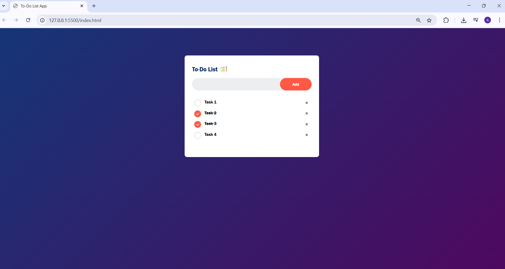

# 📝 Todo App

A simple and responsive Todo List web application built using **HTML**, **CSS**, and **JavaScript**. This app helps users keep track of daily tasks with a clean and user-friendly interface.

## 🚀 Features

- ✅ Add new tasks
- 🗑️ Delete tasks
- ✔️ Mark tasks as completed
- 💾 Tasks persist until page refresh (local memory)
- 💡 Simple and intuitive design

## 📸 Screenshots

 <!-- Replace with actual screenshot path -->

 <!-- Replace with actual screenshot path -->

## 🛠️ Tech Stack

- **HTML5** – Structure of the app
- **CSS3** – Styling and layout
- **JavaScript** – Core functionality and interactivity

## 📂 Folder Structure

